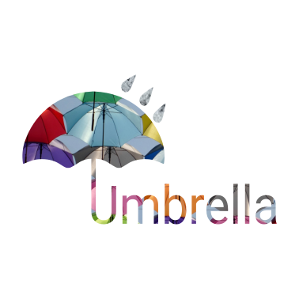

# Umbrella

Umbrella is a web application that serves as a platform for discussion. Users, once created, can login, logout, join specific discussion groups (drops) and post. These drops are a space for discussion of a particular topic. Once posted under a drop, the users will have the ability to comment on a post as well. A post can be made up of text, pictures, and links.
